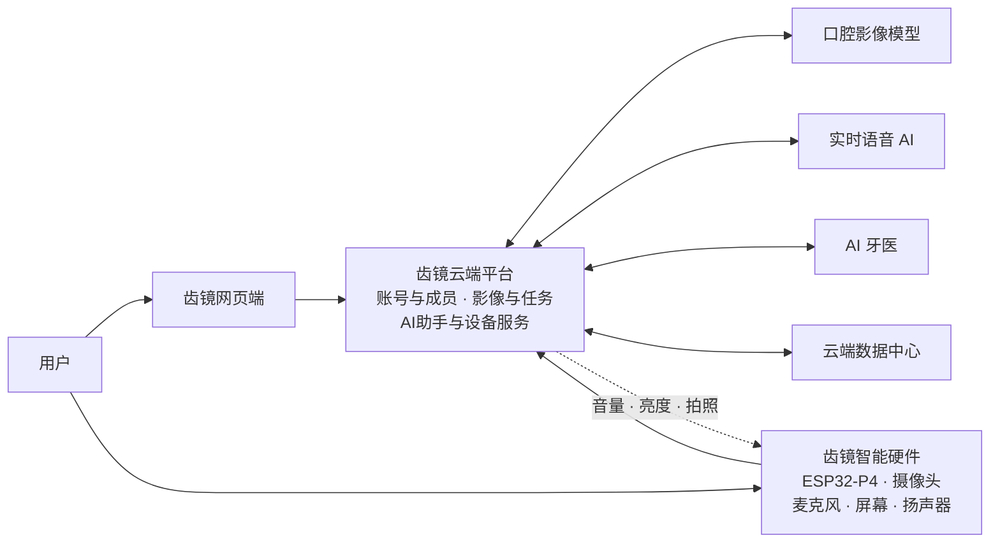

# 齿镜系统结构图重绘与视频说明

## 文件用途

- `齿镜智能口腔健康系统结构图.html`：推荐作为后续修改母版。所有主要组件都是独立 HTML 元素，可以直接修改文字、尺寸、颜色和排列。
- `齿镜智能口腔健康系统结构图.svg`：可编辑母版，适合在 Illustrator、Inkscape、Figma、PowerPoint 中继续修改。
- `齿镜智能口腔健康系统结构图.png`：1920×1080 高清预览图，可直接放进视频或 PPT。

## 版面结构

画面从左到右分为四列：

1. 用户
2. 齿镜网页端与齿镜智能硬件
3. 齿镜云端平台
4. AI 服务与云端数据中心

各列采用固定网格对齐。替换网页截图或硬件动画素材时，不需要移动其他组件。

## 可替换的视觉区域

打开 HTML 版本后，可以直接点击网页端或硬件端的插图区域，选择本地图片进行替换。工具栏还提供：

- 编辑文字
- 保存当前修改
- 恢复原稿
- 适应窗口
- 打印或另存为 PDF

SVG 中已经为主要组件设置了独立分组 ID：

- `replace-web-visual`：网页端插图区域
- `replace-device-visual`：硬件端插图区域
- `component-web`：完整网页端卡片
- `component-device`：完整硬件端卡片
- `layer-cloud`：完整云端平台
- `ai-services`：AI 服务区
- `data-center`：数据中心

替换网页端和硬件端素材时，建议保持素材中心与原插图中心一致：

- 网页端视觉区域：约 302×128 像素
- 硬件端视觉区域：约 302×128 像素

如果使用透明背景的硬件动画图，可适当超出该区域，但建议不要覆盖卡片标题。

## 信息流颜色

- 蓝色：口腔影像
- 紫色：语音与对话
- 橙色虚线：设备控制
- 灰色：普通业务数据
- 绿色：分析报告或健康分析结果

如果重绘后颜色显得过多，可以保留橙色控制指令，其余箭头统一改为深灰色，再通过箭头标签区分。

## 推荐视频出场顺序

### 第一阶段：交互入口

出现用户，随后分别出现网页端和齿镜智能硬件。

旁白：

> 用户可以通过齿镜网页端管理家庭成员和口腔记录，也可以直接使用齿镜智能硬件采集口腔影像和语音。

### 第二阶段：云端平台

从网页端和硬件端向中间延伸箭头，展开齿镜云端平台。

旁白：

> 网页和设备产生的数据统一进入齿镜云端平台。平台负责账号与成员管理、影像管理、模型任务调度，以及 AI 助手和设备服务。

### 第三阶段：AI 与数据

展开右侧智能分析服务和云端数据中心。

旁白：

> 云端平台根据任务调用口腔影像模型、实时语音 AI 和 AI 牙医，并将影像、检测结果、分析报告和对话记录统一保存。

### 第四阶段：完整链路

依次高亮蓝色影像流、紫色语音流和橙色设备控制流。

旁白：

> 影像经过模型分析后返回检测结果；语音经过识别、理解和合成后返回设备播放；AI 助手还可以根据用户指令调节设备音量、屏幕亮度或控制拍照。

## 动画分组建议

导入 After Effects、剪映或其他软件后，可以按照以下 SVG 分组制作动画：

1. `layer-user`
2. `layer-entry`
3. `layer-cloud`
4. `layer-ai-data`
5. `flow-image`
6. `flow-voice`
7. `flow-control`
8. `flow-analysis`
9. `flow-data`
10. `legend`

建议组件使用淡入和轻微上移，数据流使用路径描边动画。不要让所有箭头同时循环运动，以免影响观众理解。

## Mermaid 简化版

