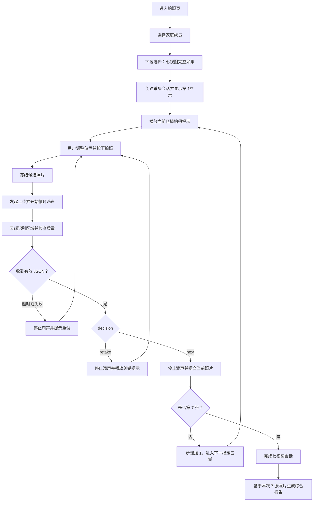
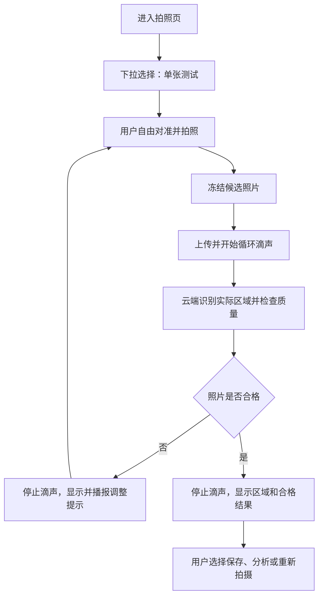

# 七视图与单张测试采集流程修改方案

> 文档性质：修改前方案确认稿  
> 适用项目：基于 ESP32-P4 的端云协同口腔健康筛查系统  
> 当前约束：本文只确定交互、接口、状态和修改边界；未经确认不修改业务代码；各阶段独立实施、独立验收，不跨阶段同时改动。  
> 展示目标：在 8 月 14 日现场稳定演示“七视图完整采集”和“单张测试”两种拍摄方式。

## 1. 修改目标

本次修改不以增加传感器或扩充疾病类别为主要目标，而是把现有的“拍一张、上传一张”升级为可选择的两种采集方式：

1. **七视图完整采集**：按照固定顺序采集七个口腔区域。每张照片拍摄后上传云端大模型进行区域与质量检查；合格则保存并进入下一视图，不合格则根据云端提示重新拍摄当前视图。七张全部合格后形成一次完整采集。
2. **单张测试**：保留用户自由拍摄一张照片并上传测试的能力，不强制完成七个区域，适用于调试、快速体验或只关注某一区域的情况。

本次修改要解决的真实问题是：普通用户不清楚应拍哪些位置，也难以判断照片是否拍对、是否清晰以及能否用于后续筛查。系统应在拍摄阶段完成引导和纠错，而不是等报告生成后才发现图像不可用。

## 2. 关键需求确认

### 2.0 工程实现总原则

- 板端始终只保留当前一张摄像头快照，不保存七张 RGB565 或 JPEG；每张上传后只记录云端返回的 ID。
- 照片上传采用单任务串行处理，不允许七个请求并发，也不在业务层简单连续创建七个临时上传任务。
- 上传结果通过 Queue 交给 Presenter 统一处理；网络任务不能直接推进 LVGL 页面和七视图序号。
- 每个异步结果必须同时校验 `request_id`、`capture_session_id` 和本地 `cancel_generation`，防止取消后的迟到结果串入新会话。
- 主采集链路稳定前只显示等待动画；循环等待滴声作为后续独立阶段接入，避免音频、TLS、摄像头和 LVGL 同时改动。
- 每完成一个阶段，由用户执行编译和必要的设备测试；本文编写者不执行编译。

### 2.1 “滴滴滴”等待音的用途

“滴滴滴”不是拍摄倒计时音，而是**照片已经拍摄完成后，上传云端并等待大模型判定结果期间的持续反馈音**。

其目的包括：

- 告知用户设备没有卡死，正在上传和分析；
- 弱化 2～3 秒网络与模型等待带来的停顿感；
- 配合屏幕上的“正在检查”状态形成明确反馈。

声音时序必须满足：

1. 用户按下拍照按钮，板端冻结并保存当前候选画面；
2. 上传任务成功启动后，进入“云端检查中”状态并开始循环播放短促滴声；
3. 上传、网络等待和模型检查期间继续播放，但滴声不能阻塞网络任务或 LVGL 界面；
4. 收到有效 JSON、发生超时、网络失败或用户取消时立即停止滴声；
5. 停止滴声后再播放“拍摄成功”“请靠近一点”等结果语音，避免两种声音重叠。

推荐节奏为短促、低干扰的单次滴声，每 600～900 ms 播放一次。它只表示“处理中”，不能暗示检查一定成功。

### 2.2 云端大模型的强制职责

云端不能只返回自然语言。它必须根据板端传入的目标区域，对照片完成以下判断并返回结构化 JSON：

- 当前照片实际属于七个区域中的哪一个；
- 是否与当前要求拍摄的区域一致；
- 图像是否满足进入正式采集的基本质量要求；
- 不合格时的主要错误类型；
- 板端下一步应重拍当前区域，还是进入下一个区域；
- 可直接播报给用户的简短中文提示。

疾病风险检测与“照片能否用于采集”是两个不同任务。七视图采集阶段首先调用专用的拍摄质量检查接口，不应直接使用自由问答式大模型输出控制设备状态。

### 2.3 拍照页增加采集方式下拉窗口

拍照界面增加“采集方式”下拉选择，至少提供：

- `七视图完整采集`
- `单张测试`

建议默认选择“七视图完整采集”，突出项目的核心亮点。下拉框应在实时预览、尚未开始采集时可操作；一旦七视图任务开始，就锁定选择，防止中途切换导致会话和照片归属混乱。用户主动结束或七张完成后再解除锁定。

## 3. 七视图区域定义

七个区域的程序 ID、中文名称和顺序固定如下：

| 序号 | 区域 ID | 界面名称 | 拍摄提示重点 |
|---:|---|---|---|
| 1 | `front_bite` | 正面咬合位 | 牙齿自然咬合，正面对准，显示上下前牙及两侧牙列 |
| 2 | `left_bite` | 左侧咬合位 | 拍摄用户本人的左侧咬合关系 |
| 3 | `right_bite` | 右侧咬合位 | 拍摄用户本人的右侧咬合关系 |
| 4 | `upper_left_open` | 张口左上牙区 | 张口，镜头对准用户本人的左上牙区 |
| 5 | `upper_right_open` | 张口右上牙区 | 张口，镜头对准用户本人的右上牙区 |
| 6 | `lower_left_open` | 张口左下牙区 | 张口，镜头对准用户本人的左下牙区 |
| 7 | `lower_right_open` | 张口右下牙区 | 张口，镜头对准用户本人的右下牙区 |

注意事项：

- “左、右”必须始终以用户本人为基准；
- 摄像头预览、上传图像和云端判断必须使用一致的镜像规则；
- 当前名称属于项目定义的家庭筛查七视图，不在未经专业验证时宣称为临床标准全口检查。

## 4. 拍照界面调整

### 4.1 实时预览状态

拍照页建议包含：

- 家庭成员选择；
- “采集方式”下拉框；
- 实时摄像头预览；
- 补光灯状态；
- 当前步骤信息；
- 拍照按钮；
- 状态提示区域。

当选择“七视图完整采集”时，额外显示：

- `第 1/7 张`一类的进度；
- 当前区域名称；
- 当前区域简短姿势提示；
- 七个区域的完成/当前/未完成状态；
- 如界面空间允许，显示当前区域示意图。

当选择“单张测试”时：

- 不显示七视图进度；
- 用户可以自由拍摄；
- 云端可以判断实际区域及质量，但不要求与预定步骤匹配；
- 本次操作只处理一张照片，完成后回到可继续拍摄状态。

### 4.2 云端检查状态

照片拍摄后：

- 冻结刚拍摄的候选照片；
- 禁用拍照按钮、下拉框和成员切换；
- 显示“AI 正在检查第 N/7 张：区域名称”；
- 显示上传/分析动画；
- 循环播放等待滴声；
- 保留取消按钮时，取消操作必须同时终止滴声，并忽略迟到的云端结果。

### 4.3 检查结果状态

合格时：

- 停止等待滴声；
- 显示绿色合格状态；
- 播放“当前区域拍摄成功”；
- 将候选照片转为正式照片；
- 七视图模式自动进入下一步；
- 第七张完成后进入“本次采集完成”页面。

不合格时：

- 停止等待滴声；
- 在冻结照片上显示不合格原因；
- 播放云端返回的简短调整提示；
- 不把候选照片计入七视图正式结果；
- 返回当前区域实时预览并要求重拍；
- 不改变当前序号。

## 5. 七视图完整采集流程

### 5.1 总体流程



### 5.2 单个区域的详细时序

1. 板端设置 `expected_region` 为当前步骤要求的区域。
2. 屏幕和扬声器提示用户当前应拍摄的姿势。
3. 用户完成对准后按下拍照按钮。
4. 板端冻结当前帧，将其作为临时候选照片。
5. 板端发起云端质量检查请求。
6. 请求成功进入异步处理后，开始循环播放等待滴声。
7. 云端大模型根据 `expected_region` 检查照片并返回 JSON。
8. 板端先验证 HTTP 状态、JSON 完整性、请求 ID 和当前会话是否一致。
9. 验证通过后停止滴声，再根据 `decision` 执行：
   - `retake`：播报 `instruction`，丢弃或标记候选照片无效，继续拍当前区域；
   - `next`：确认保存当前照片，标记该区域完成，进入下一指定区域；
   - `complete`：仅允许在第七张合格时出现，完成整个会话。
10. 如果返回结果迟到且会话已经取消或请求 ID 不一致，板端必须丢弃该结果，不能改变当前界面。

### 5.3 完成条件

七视图采集完成必须同时满足：

- 七个固定区域均有且只有一张已确认合格的正式照片；
- 七张照片属于同一个 `capture_session_id`；
- 七张照片属于同一个家庭成员；
- 所有云端判定结果均与板端请求 ID 对应；
- 不存在缺失区域或重复区域。

七张完成后，综合报告必须读取本次会话的七张照片，不能继续使用“最近最多 6 张照片”的旧规则。

## 6. 单张测试流程



单张测试与七视图模式的主要区别：

- 不创建必须集齐七张的强制流程；
- 请求中的 `expected_region` 可以为 `free`；
- 云端仍返回识别到的 `detected_region`；
- 云端不因“没有按照七视图当前顺序”而判定错误；
- 合格后不自动跳转至下一固定区域；
- 是否保存和继续分析由用户选择。

## 7. 板端状态机

建议为采集业务建立独立状态，避免仅依赖界面文字判断流程：

| 状态 | 含义 | 允许操作 |
|---|---|---|
| `IDLE` | 拍照页空闲 | 选择模式、成员，开始预览 |
| `GUIDING` | 正在显示/播报当前区域提示 | 调整探头、拍照、退出 |
| `CAPTURED` | 候选帧已冻结 | 发起检查或重拍 |
| `UPLOADING` | 正在编码和上传 | 显示等待，禁止重复提交 |
| `VALIDATING` | 云端大模型正在检查 | 循环滴声，等待结果或取消 |
| `RETAKE_REQUIRED` | 当前照片不合格 | 播报提示，返回当前区域预览 |
| `REGION_ACCEPTED` | 当前区域合格 | 保存并进入下一步 |
| `SESSION_COMPLETE` | 七张全部完成 | 生成报告或返回首页 |
| `ERROR` | 网络、超时、JSON 或服务错误 | 重试、取消，必要时人工处理 |

### 7.1 需要保存的七视图会话状态

```text
capture_mode          = seven_view | single_test
capture_session_id    = 本次七视图会话唯一 ID
member_id             = 当前家庭成员 ID
current_region_index  = 0..6
expected_region       = 当前要求区域 ID
completed_mask        = 七个区域完成位图
request_id            = 当前云端请求 ID
retry_count           = 当前区域重拍次数
waiting_sound_active  = 等待滴声是否正在播放
temporary_image_id[7] = 七个区域各自的云端临时图片 ID，不保存图片内容
cancel_generation     = 会话取消代数，用于丢弃迟到异步结果
```

## 8. 云端请求协议建议

### 8.1 请求字段

为降低 ESP32-P4 连续内存压力，沿用现有上传方式：请求体直接发送 JPEG，`Content-Type: image/jpeg`，业务元数据通过 HTTP 请求头传输。禁止先在板端拼接完整 multipart 请求体；如以后必须使用 multipart，只能流式分段发送。

| HTTP 位置/字段 | 必填 | 说明 |
|---|---:|---|
| 请求体 | 是 | 当前候选 JPEG 原始字节 |
| `Authorization: Bearer ...` | 是 | 已绑定设备令牌 |
| `X-Member-Id` | 是 | 当前家庭成员 `public_id` |
| `X-Capture-Mode` | 是 | `seven_view` 或 `single_test` |
| `X-Capture-Session-Id` | 七视图必填 | 一次完整采集的唯一 ID |
| `X-Request-Id` | 是 | 本次请求唯一 ID，用于幂等和拒绝迟到结果 |
| `X-Expected-Region` | 是 | 七视图为固定区域；单张模式为 `free` |
| `X-Region-Index` | 七视图必填 | `1..7` |

### 8.2 成功响应 JSON

```json
{
  "ok": true,
  "request_id": "req-20260812-0001",
  "capture_session_id": "session-20260812-0001",
  "capture_mode": "seven_view",
  "expected_region": "front_bite",
  "detected_region": "front_bite",
  "region_match": true,
  "accepted": true,
  "decision": "next",
  "reason_code": "ok",
  "instruction": "正面咬合位拍摄成功",
  "quality": {
    "sharpness": "pass",
    "exposure": "pass",
    "coverage": "pass",
    "occlusion": "pass",
    "reflection": "pass"
  },
  "confidence": 0.91,
  "temporary_image_id": "tmp_abc123"
}
```

### 8.3 错误区域响应 JSON

```json
{
  "ok": true,
  "request_id": "req-20260812-0002",
  "capture_session_id": "session-20260812-0001",
  "capture_mode": "seven_view",
  "expected_region": "left_bite",
  "detected_region": "right_bite",
  "region_match": false,
  "accepted": false,
  "decision": "retake",
  "reason_code": "wrong_region",
  "instruction": "当前拍摄的是右侧，请改为拍摄您本人的左侧咬合位",
  "quality": {
    "sharpness": "pass",
    "exposure": "pass",
    "coverage": "pass",
    "occlusion": "pass",
    "reflection": "pass"
  },
  "confidence": 0.88,
  "temporary_image_id": "tmp_def456"
}
```

### 8.4 图像质量不合格响应 JSON

```json
{
  "ok": true,
  "request_id": "req-20260812-0003",
  "capture_session_id": "session-20260812-0001",
  "capture_mode": "seven_view",
  "expected_region": "upper_left_open",
  "detected_region": "upper_left_open",
  "region_match": true,
  "accepted": false,
  "decision": "retake",
  "reason_code": "target_too_small",
  "instruction": "牙齿区域太小，请靠近一点",
  "quality": {
    "sharpness": "pass",
    "exposure": "pass",
    "coverage": "fail",
    "occlusion": "pass",
    "reflection": "pass"
  },
  "confidence": 0.84,
  "temporary_image_id": "tmp_ghi789"
}
```

### 8.5 允许的固定枚举

`detected_region`：

```text
front_bite
left_bite
right_bite
upper_left_open
upper_right_open
lower_left_open
lower_right_open
unknown
```

`decision`：

```text
retake
next
complete
```

`reason_code`：

```text
ok
wrong_region
region_uncertain
target_too_small
target_too_close
target_cropped
off_center
blurred
too_dark
overexposed
strong_reflection
occluded
not_oral_image
multiple_problems
```

板端只能依据固定字段和枚举控制状态，不能解析自然语言来决定跳转。`instruction` 只用于显示和播报。

## 9. 云端大模型判定规则

云端提示词或模型服务应接收 `expected_region`，并按以下顺序检查：

1. 是否为有效口腔图像；
2. 是否能判断实际区域；
3. 七视图模式下，实际区域是否与要求区域一致；
4. 目标牙区是否完整且位于合理位置；
5. 是否明显太远、太近或被裁切；
6. 是否明显模糊；
7. 是否过暗、过曝或反光严重；
8. 是否存在嘴唇、舌头、手指等严重遮挡；
9. 最终只返回一个对用户最有帮助的主要纠错提示。

“远近”在当前无可靠 ToF 的情况下表示视觉构图判断：

- 牙齿目标在画面占比过小，返回 `target_too_small` 和“请靠近一点”；
- 目标被大面积裁切或镜头过近，返回 `target_too_close`/`target_cropped` 和“请稍微远离”；
- 不输出毫米级距离，不宣称完成精确测距。

模型输出必须经过服务端 JSON Schema 校验。若模型输出缺字段、字段越界或置信度不足，服务端统一返回 `region_uncertain` 与 `retake`，不能把不可解析文本直接转发给板端。

## 10. 等待滴声控制方案

等待滴声应由板端本地生成或播放本地短音频，不依赖云端返回音频。

等待滴声不属于第一批主流程改动。应在云端接口、上传 Worker、状态机和页面切换都稳定后单独实施；在此之前使用界面动画表达“正在检查”。

建议控制逻辑：

```text
拍照完成
  -> 上传任务成功受理
  -> waiting_sound_start()
  -> 每 600～900 ms 播放一次短滴声
  -> 收到成功/失败/超时/取消事件
  -> waiting_sound_stop()
  -> 播放结果语音
```

必须处理：

- 滴声播放任务与上传任务并行，不能在上传线程中阻塞等待；
- 重复调用开始函数不能创建多个滴声定时器；
- 所有退出分支都必须停止滴声；
- 播放纠错语音前先停止滴声；
- 语音播放、等待滴声和现有 AI 回答播放需要共享扬声器互斥，避免多路音频同时占用 ES8311；
- 用户取消后，即使服务器迟到返回，也不能重新开始声音或跳转步骤。

## 11. 照片保存策略

建议使用“临时候选—确认提交”两阶段：

1. 候选照片上传后先进入临时存储，不立即进入家庭成员正式影像档案；
2. `accepted=false` 时删除临时照片或标记为无效；
3. `accepted=true` 时由板端调用确认接口，或由云端原子地将照片转为正式记录；
4. 正式记录至少保存 `capture_session_id`、`region_id`、`member_id`、质量结果和拍摄时间；
5. 只有七个区域全部确认后，才将会话标记为 `complete`；
6. 未完成会话应标记为 `cancelled` 或 `incomplete`，不能与完整报告混用。

如果展示前时间不足以实现独立确认接口，也必须保证不合格候选图不会被综合报告选中。

## 12. 异常与兜底流程

### 12.1 网络断开

- 拍照前发现离线：七视图模式禁止发起云端检查，提示先连接网络；
- 上传期间断网：停止滴声，保留候选画面，显示“网络连接失败，请重试”；
- 网络恢复后只重试当前区域，不回退已完成区域。

### 12.2 请求超时

- 建议板端设置总超时，例如 8～10 秒，实际数值在联调后确定；
- 超时立即停止滴声；
- 不自动把照片判为合格；
- 提供“重新检查”和“重新拍摄”；
- 迟到响应通过 `request_id` 丢弃。

### 12.3 JSON 非法或字段缺失

- 停止滴声；
- 状态进入 `ERROR`；
- 显示“云端结果无效，请重新检查”；
- 不保存照片，不推进七视图序号。

### 12.4 大模型无法确定区域

- 返回 `detected_region=unknown`；
- 返回 `decision=retake`；
- 提示用户按当前区域示意重新对准；
- 连续多次不确定时允许退出本次采集，但不能自动跳过该区域并生成完整报告。

### 12.5 用户中途退出

- 弹窗确认“退出后本次七视图将保存为未完成”；
- 停止上传等待音和后续自动跳转；
- 将会话标记为 `cancelled` 或 `incomplete`；
- 已完成照片是否保留由后端策略决定，但不能作为完整七视图报告输入。

## 13. 与当前固件结构的衔接

根据当前代码图谱和源码，已有结构可作为修改基础：

- `dentiscope_capture` 已管理实时、已拍摄、分析中和结果等界面状态；
- `app_view` 已把拍照、重拍、端侧检测、云端检测和上传动作转发给 Presenter；
- `app_presenter` 已负责冻结摄像头帧、检查成员/网络状态并发起照片上传；
- `photo_upload_service` 已异步编码 JPEG、上传并发布 `ENCODING / UPLOADING / SUCCEEDED / FAILED` 状态；
- 当前照片上传回调只提供状态、HTTP 状态码和文本消息，不足以承载七视图区域判定结果；
- 当前响应缓存约 512 字节，无法可靠承载完整判定 JSON；应改为约 4 KiB 的 PSRAM 临时缓冲，解析完成立即释放，不能直接扩大任务栈数组；
- 当前每次请求动态创建上传任务，不适合七视图反复创建/删除；应改为初始化时创建一个常驻 Worker，并用长度为 1 的 Queue 串行投递；
- `voice_playback_service` 与 `board_support` 已具备 Opus 解码、扬声器打开和 PCM 写入链路，可为后续等待滴声与本地提示音复用硬件能力。
- 摄像头通过 PPA 直接写显示帧缓冲；七视图状态切换需要遵循“暂停预览—冻结—提交全部显示缓冲—恢复 Capture 页面—恢复预览”，采集中只更新固定控件，不反复重建整页。

预计需要扩展但本文暂不实施的模块边界：

| 模块 | 预计职责变化 |
|---|---|
| `dentiscope_capture` | 增加采集方式下拉框、七视图进度、当前区域和等待/纠错状态 |
| `app_view` | 增加模式选择、七视图开始/取消等动作和结果更新接口 |
| `app_presenter` | 增加采集会话状态机，依据结构化结果决定重拍或下一步 |
| `photo_upload_service` | 增加七视图质量检查模式、请求字段和结构化 JSON 结果回调 |
| 音频播放层 | 增加可取消、非阻塞、循环的本地等待滴声，并协调语音播放互斥 |
| 云端接口 | 识别七区域、质量检查、JSON Schema 校验、临时照片确认/废弃 |
| 报告服务 | 按 `capture_session_id` 读取同一次七视图的七张合格照片 |

## 14. 分阶段实施路线

每一阶段只修改该阶段列出的模块。完成后停止扩展，由用户单独编译并按验收点判断是否进入下一阶段；不得把多个阶段堆在一次修改中排查编译错误。

### 阶段 1：云端验证接口与协议

- 仅修改云端，不修改固件；
- 固定原始 JPEG + HTTP 请求头协议；
- 实现七视图会话、临时候选图片、区域/质量验证、幂等请求、确认和丢弃；
- 输出经过白名单归一化的固定 JSON；
- 用正确区域、错误区域、模糊图和非口腔图独立验收。

详细规格见《第一阶段_七视图云端对接规范.md》。只有云端字段、响应上限、七区域效果和真实延迟完成验收后才进入阶段 2。

### 阶段 2：板端上传服务基础改造

- 只改 `photo_upload_service` 及必要的数据类型；
- 改为常驻单 Worker + 长度为 1 的 Queue；
- 沿用原始 JPEG 请求体并增加七视图请求头；
- 使用约 4 KiB PSRAM 响应缓存，解析后立即释放；
- 使用 JSON 解析器和枚举白名单生成 `photo_validation_result_t`；
- 不改拍照页面、不做七张循环、不加等待音。

独立验收点：现有单张入口只发起一次请求，Presenter 能收到结构化结果，请求结束后内存释放。用户自行编译和设备验证。

### 阶段 3：单张测试闭环与异步隔离

- 上传结果经 Queue 交给 Presenter，网络回调不直接操作 UI；
- 引入 `request_id`、`cancel_generation` 和迟到响应丢弃；
- 先打通单张合格、重拍、超时、取消、断网五条路径；
- 页面切换遵守 PPA 预览和全部显示缓冲提交规则；
- 不做七张循环、不加等待音。

独立验收点：五条路径互不串台，取消后的结果不会改变页面。用户自行编译和设备验证。

### 阶段 4：七视图状态机

- 板端只保存会话元数据、`completed_mask` 和七个 `temporary_image_id`；
- 固定顺序串行处理七区，每次只持有当前一张图；
- 合格后释放当前 JPEG 并恢复预览；重拍不推进，重复回调不重复推进；
- 先用云端模拟固定结果走完七步，再使用真实模型。

独立验收点：七步顺序、重拍、取消和异常可分别复现。用户自行编译和设备验证。

### 阶段 5：下拉框与七视图进度 UI

- 只改 UI/View 和必要动作映射；
- 增加“七视图完整采集 / 单张测试”下拉框；
- 增加当前区域、`N/7`、完成标记和等待动画；
- 采集中锁定模式和成员选择；
- 只更新固定控件，不反复重建拍照页面；
- 不加等待音。

独立验收点：先以模拟事件检查所有页面状态，再执行真实七视图流程。用户自行编译和设备验证。

### 阶段 6：等待滴声与结果语音

- 使用常驻音频任务或定时机制，不为每声滴声创建任务；
- `start/stop` 幂等，并与现有 AI Opus 播放共享扬声器互斥；
- 成功、失败、超时、取消和退出页面都必须停止；
- 先停止滴声，再播报结果。

独立验收点：连续七张、取消、超时和 AI 回复同时到达时无声音重叠或残留。用户自行编译和设备验证。

### 阶段 7：正式归档与七视图报告

- 七个区域确认后完成会话；
- 正式档案只包含已接受照片；
- 报告按 `capture_session_id` 精确读取七张，不再选择“最近 6 张”；
- 未完成、跨成员、缺区或重复区域的会话不能生成完整报告。

独立验收点：报告输入恰好是同一成员、同一会话、七个不同区域的七张照片。

### 原功能优先级清单（仅作范围参考，不作为实施顺序）

### 原 P0 功能范围（已由阶段 1～7 重新排序）

1. 拍照页增加“七视图完整采集 / 单张测试”下拉选择；
2. 固定七个区域 ID、顺序、界面文字和播报文字；
3. 云端质量检查接口识别七个区域并返回固定 JSON；
4. 板端拍照后上传，等待期间循环滴声，所有结束分支正确停止；
5. 板端根据 `decision` 执行当前区域重拍或进入下一区域；
6. 使用会话 ID 关联七张照片；
7. 综合报告改为读取本次会话的七张合格照片；
8. 网络失败、超时、非法 JSON 时不能误保存、误跳步或一直滴声；
9. 完成至少三次七视图端到端演练。

### 原 P1 功能范围（仅供后续参考）

- 七区域缩略图和完成标记；
- 当前区域示意图；
- 影像档案显示区域名称与会话；
- 统计每张照片的上传与模型耗时；
- 本地进行简单的亮度/清晰度预检查；
- 未完成会话恢复或继续采集。

### 暂缓

- 唤醒词；
- ToF 与 IMU；
- 端侧疾病模型大规模重训；
- 单颗牙自动精细补拍；
- 刷牙前后同区域自动配准。

## 15. 联调与验收清单

### 15.1 云端模型验收

- [ ] 七个区域分别准备正确样图，均能返回对应 `detected_region`；
- [ ] 将左侧图用于右侧步骤时，返回 `wrong_region + retake`；
- [ ] 模糊图返回 `blurred + retake`；
- [ ] 目标过小返回 `target_too_small + retake`；
- [ ] 目标裁切返回 `target_cropped + retake`；
- [ ] 非口腔图返回 `not_oral_image + retake`；
- [ ] 所有响应均通过 JSON Schema 校验；
- [ ] 服务端实际响应时间经过记录，不凭估计宣称固定 2～3 秒。

### 15.2 板端流程验收

- [ ] 下拉框能正确切换两种模式；
- [ ] 七视图开始后下拉框和成员切换被锁定；
- [ ] 拍照完成并开始上传后才播放等待滴声；
- [ ] 收到成功、失败、超时或取消时均能停止滴声；
- [ ] 错误区域不会推进序号；
- [ ] 合格区域只推进一次，不会因重复回调跳过区域；
- [ ] 第七张成功后进入完成状态；
- [ ] 单张测试不会进入七视图下一步；
- [ ] 请求迟到或会话 ID 不匹配时不会改变当前状态；
- [ ] 退出页面时不会残留滴声、上传动画或自动跳转。

### 15.3 数据与报告验收

- [ ] 不合格候选图不进入完整报告；
- [ ] 七个区域不存在缺失或重复；
- [ ] 七张照片均属于同一成员和同一会话；
- [ ] 报告读取七张而不是旧逻辑中的最近六张；
- [ ] 未完成会话不能生成“完整七视图报告”。

## 16. 展示时的建议讲法

> 传统家庭口腔拍摄最大的问题不是按不下快门，而是不知道拍哪里、拍得是否可用。我们的终端提供七视图完整采集和单张测试两种模式。在七视图模式下，设备逐区域引导用户拍摄；每次拍照后，云端视觉大模型识别当前区域并检查清晰度、构图、曝光和遮挡。等待期间设备通过短促提示音告知用户正在处理；如果拍错区域或照片不合格，设备会明确提示如何调整并要求重拍，合格后才进入下一位置。七张照片全部通过后，系统才生成一次完整的家庭口腔初筛报告。

该表述强调的是“标准化采集和实时纠错”，不把作品描述成医疗诊断设备，也不承诺毫米级测距或绝对诊断准确率。

## 17. 修改前需要最终确认的事项

正式改代码前需要确认：

1. 七个区域名称、左右基准和顺序是否按本文固定；
2. 下拉框是否默认选择“七视图完整采集”；
3. 单张测试合格后是自动保存，还是由用户选择保存/分析；
4. 云端质量检查接口的实际 URL、认证方式和后端代码位置；
5. 云端采用何种视觉大模型，以及七区域样图是否已经准备；
6. 合格照片采用服务端直接转正式记录，还是板端再次调用确认接口；
7. 等待滴声使用本地 PCM/Opus 资源还是运行时生成短音；
8. 网络超时阈值和连续重拍次数是否需要限制；
9. 七视图完成后是否立即生成报告，还是先显示七张缩略图供用户确认。

完成上述确认后，再按 P0 顺序实施，避免同时改动唤醒词、传感器和端侧疾病模型而分散展示前的开发时间。
